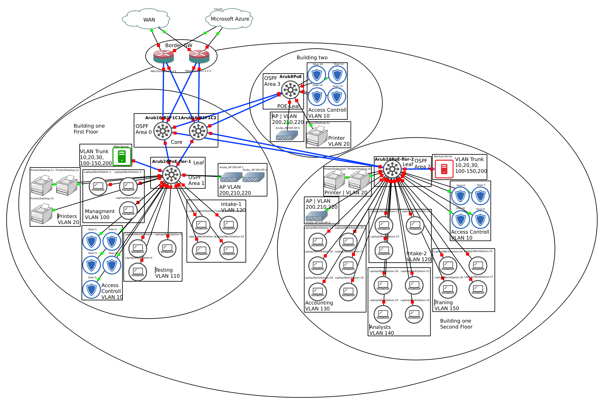
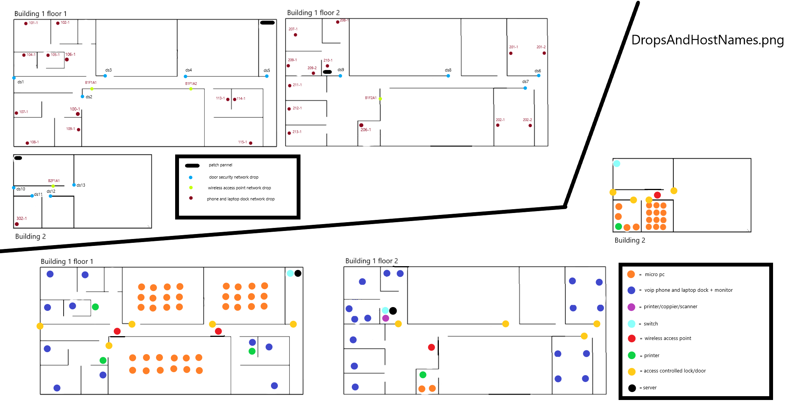
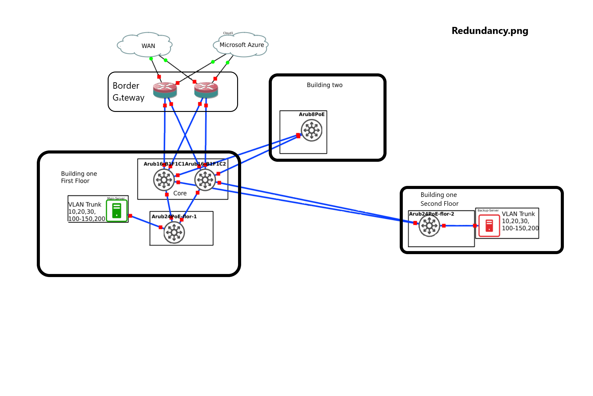
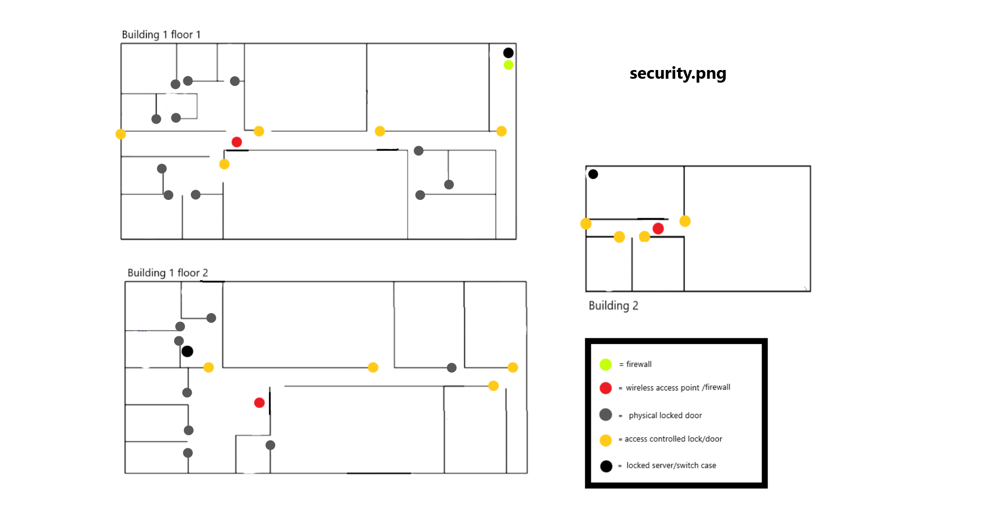

# 
**Case Study #2**
 
 By Julian Mato-Hernandez & Evan Jurdan 

# Document Outline
- [Document Outline](#document-outline)
- [Executive summary](#executive-summary)
- [Introduction](#introduction)
    - [Assignment Outline](#assignment-outline)
    - [Project Outline](#project-outline)
- [Requirements Analysis](#requirements-analysis)
    - [General Requirements](#general-requirements)
    - [Hardware Requirements](#hardware-requirements)
    - [Software Requirements](#software-requirements)
- [Network Structure](#network-structure)
    - [Network Border](#network-border)
    - [Network Core](#network-core)
    - [Network Access](#network-access)
    - [Network WLAN](#network-wlan)
    - [Servers and Services](#servers-and-services)
    - [Security and Network Managment](#security-and-network-managment)
- [Network Maps](#network-maps)
    - [Logical](#logical)
    - [Phisical with Devices](#phisical-with-devices)
    - [Redundancies](#redundancies)
    - [Security Devices](#security-devices)
    - [Client Systems](#client-systems)
    - [Employee Systems](#employee-systems)
- [Budget and Justification](#budget-and-justification)
    - [Justification](#justification)
    - [Total Cost](#total-cost)
    - [General BOM](#general-bom)
    - [Azure BOM](#azure-bom)
- [Scalability](#scalability)
- [Optimizations Suggested](#optimizations-suggested)
- [Summary](#summary)
- [Appendix A Q&A](#appendix-a-qa)
- [Appendix B Cost Analasys Sources](#appendix-b-cost-analasys-sources)
 
 
 

# Executive summary:
For this network the customer needed a nearly complete ground up design of their network. This network contains new equipment (PC, Laptops, Infrastructure, and security devices) along with a host of software (Email, Storage, Network Monitoring, and security). The customer needs these basic services to be as reliable and functional as possible. We will be providing a cloud based work environment centered around Microsoft Azure, this will provide AD, Storage, backups, email, notifications, and parts of security. Along with this cloud infrastructure we will be providing a Full unified wired and wireless network to both buildings.
 
 
 

# Introduction:
## Assignment Outline
There is a small government business. The business is trying to update their office and put in a network. They have five departments, three management staff, and some training providers in two buildings. They need a network to share information and documents over while that information must remain secure to government standards.
 
 

## Project Outline -      
This paper outlines the design of a network for a small buisness. This network is an improvement over a previous design for the same building. The myriad of nessesary fetures have been satisfied as well as an improvement in security and network optimization. We have a cloud hybrid solution that maximise security, accountability and expandability as well as easing the onsite IT.
 
 
 

# Requirements Analysis:
## General Requirements -     
This building had only a small network in acounting. The buisness needed to have Computers for employees and secure storage and trasfer of confidential records. They are a government buisness and need their data to be secure but they also needed to be able to share between certaint departments and better analize data. 
 
 

## Hardware Requirements -     
The company needed an entire network from scratch. They needed a desktop computer per employee as well as a laptop per employee. There were also 54 micro computers to put in classroom labs. Each desktop and micro computer needed a monitor and periferals. We needed to design a network and purchase the hardware to put it in place so we had to buy switches, a support server, and access points to implement the network that they wanted. We planned all of the cat6 cable runs throughout the building as well as the fiber lines connecting our layer 3 switches and the fiber connection under the road to the other building. They wanted a lot of office printers and a larger printer/scanner/coppier, in order to better fit in the buget not everyone could get individual printers but the people we didn't give a printer to are in extream close proximity to the large comunal printer. We mapped where there should be power drops, each power drop would have 4 connections and each internet drop would have 2 connections. 
 
 

## Software Requirements -     
Since it is a government organization they needed a secure network and a secure storage. the AZURE suite had all of the components needed to build a network that was secure and accessable. We have secure storage set up and backed up with a seperate storage for accounting for added security. AZURE also has active directory so our network has security that insures only people who are allowed to look at or edit something are allowed to view it. We also have office 365 for each person so that they have access to word prossesing, spreadsheet, and presentation software to aid in the recording of information, the analizing of data, and the formation of presentations.  
 
 
 

# Network Structure:
## Network Border -     
The network border will serve as the networks connection the WAN and as a direct link to the Azure ExpressRoute. For this topology we have chosen dual Watchguard Technologies Firebox M290 8 Port Firewall's with the optional SFP+ addon, these firewalls do duble duity being both a capable network security device and a high speed router. This device offers policy based trafic managment, DHCP, OSPF, BGP, Multi-WAN failover, jitter/latency mesurment, cloud log's and managment, DoS & DDoS protection, antivirus, and many other usefull features. the M290 has a robust throughput cappping out at 5.8Gbps with firewall only and 1.47Gbps with firewall, vpn, and antivirus active. With a throughput of 88.2Gbpm and and average buisiness persons top data use being 8.6MBpm with an estimated 27 full time employes that would only be 230.4MBpm or 0.22Gbpm, a fraction of the devices capability. Even factoring in custommer traffic there should never be any bottlenecks. And with a MTBF of 623,087 hours this gateway should rarely if ever fail.
 
 

## Network Core -     
In the core we have opted to use the the Aruba 3810M 16SFP+ (JL075A) for varius reasons, one being its ability to stack multiple 3810M devices this will allow for longevity of the device reguardless of future expansion. With a throughput of up to 95.2 Mbps on a 64-byte packet and < 1.8 microsecing latency with a 64-byte packet on a 10Gps link the data speeds should be more than suficient for even the buisiest days. Some other notable features are the devices ability to add roles to devices, these rols can be uset to prioritise trafic, restrict trafic, and add security pollicys souch as packet filltering, ClearPass policy manager which alows the network to unify all Aruba wireless and wired devices policy managment systems. And with two of these devices, one allways on standby incase of falure, the core should not only be secure but allso highly reliable.
 
 

## Network Access -     
For the access layer two devices where used, the Aruba 6100 24G PoE+ 4SFP+ (JL677A), and the Aruba 2530 8G PoE+ 2SFP+(J9780A) switches. To begin with each floor of building 1 has an Aruba 6100 switch to suport the wired devices on each floor. we went with the 6100 due to its 4 SFP+ modules allowing for 10Gbps inter switch networking for the highest throughput, along with its ampal 95.2Mpps throughput and 1.5(1 Gbps) 1.8(10 Gbps) microsecond latency these should more than sute there use case. For building two we have opted to use the smaller Aruba 2540, this device will give POE+ to all POE devices in building two along with extending the LAN to the branch with little to no latancy. The 2540 has a throughput of 4.1 Mpps and a latency of 1.3 microseconds at 1Gbps, due to the low number of systems in building two a more expensive and capable device would be wasted. that being said the 2530 is still a bapable device bringing all of the Aruba software that the 6100 and the 3810M provide shouch as ClearPass.
 
 

## Network WLAN -     
The Wirless LAN or WLAN is a central part of this network which is why we chose four Aruba AP-505 which are dual radio, POE, wifi 6 (802.11ax) access point's. These AP's will be addvertising a public guest network, employee network, and a hidden network for internal wifi devices. The guest network will have trafic rules set through ClearPass to tunnle all trafic directly to the Border blocking all internal connectinons, the employee network will be more relaxed allowing access to network printers and internal services but each emmployee will have user roles placed on them to restrict there network connections and privaliges souch as being limmited to sending to only some printers or blocking cirtain external sights, and the hidden internal network will connect to the lab PC's. AP-505's suport up to 16 BSSID's and a maximum of 256(512 total) clients per radio at 1.2Gbps(5GHz) and 287~574Mbps(2.4GHz) wirless data transfer rate. Along with exilent performance each AP-505 serves as a policy enforcment firewall giving an added level of security from any malitious party trying to levorage the wirless network.
 
 

## Servers and Services -     
We will have two Dell PowerEdge R240 set to fail over in case of falure, they are also located on diffrent flors and on diffrent switches in case a critical device fails. The servers will be running a VoIP service, print server and que, log collection(Greylog or other solution), and some on-prem storage for buffered cloud media. The R240 is a cheap lightweight system with Dell IDRAC for out of band managment along with more than suficient power for the needs of the company.
 
 

## Security and Network Managment -     
As mentioned above we will have two Watchguard Technologies Firebox M290 Firewall's protecting our network allong with the AP-505 firewall capabilities protection from internal threats. Within the network we decided to levorage Arubas Central cloud managment solution. Central allows the system administrator to agrigate all Aruba devices in to one Network managment tool, Central allows for streamlined onboarding by giving remote configuration capabilities, Central has AI Insights which diagnoses and repairs common or simple issues automaticly, along with AI automated diagnostic collection allowing for faster and more precise errors even going as far as contacting Aruba suport to diagnose and inform. Central manitors and visualises all devices data souch as network health, application visibility, UCC analytics(VoIP), and client health. With Aruba Central and Azure Active Directroy all fassets of the network can be monitord, secuted, and administrated from only two platforms.
 
 

## Client Systems - 

 
 

## Employee Systems - 
Each Employee of the full time staff will have a laptop and an office with a dock for the laptop, a phone, a ubikey, an access pass, a wireless keyboard and mouse, and a monitor. The Laptop dock allows them to connect their laptop to the wired internal network and use it as a desktop when they do not need to be moving around. The ubikey is an advanced form of access control that is a physical 2 factor authentication that keeps data and devices secure. The access pass will give them access to the rooms that they are allowed to be in with the door access control locks. Every Employee will have access to a shared printer on their floor in an easy to reach area to print, scan, and copy documents. they can also access cloud storage and their email to securely store and share information.
 
 
 

# Network Maps:
## Logical -     
\
 
 

## Phisical with Devices -     
\
 
 

## Redundancies -     
\
 
 

## Security Devices -     
\
 
 
 

# Budget and Justification:
## Justification -     
The network we desighned though over budget is easily managed and administrated, secure, delivers the quality of service desired, has a high uptime, and can be accesed remotely. Our network is also very condusive twords colabaritive work by allowing employees to move from office to common space or home without any complicated backup systems, this also streamlines phisical security of each office since no critical equipment should be stored there. A large part of the cost of this network is the access controll system, the reason why we have allocated souch a large ammount of recources to this system is because we beleve that in a facility with many non-employee individuals phisicaly securing assets is imperative. Moving away from the phisical we finnd the Cloud platforms, mainly Azure and Central, Azure is the main work environment for all employees doing everything from authentication, user managment, GPO(Group Policy), storage, email, and office 365. on the other hand Aruba Central provides network managment, visualisation, monitoring, automatic repair, automatic diagnostic, and streamlined onboarding.
 
 

## Total Cost -     
#### Total First Month in USD = $4,309.56

#### Total for reocuring payments per year in USD = $51,714.68

#### Total OTC (One Time Cost) in USD = $118,140.66

### **First Month + OTC in USD = $122,450.22**
 
 

## General BOM -     
|Amount|Product Name |Manufacturer|Description|Single Unit Cost in USD|Billing Period|Cloud Y/N|Expense Per Month in USD|Expense Per Year in USD|OTC in USD|
|:---:|:---:|:---:|:---:|:---:|:---:|:---:|:---:|:---:|:---:|
|9|Central - device/year|HPE / Aruba||$11.60|Montly|Y|$104.40|$1,252.80|N/A|
|4|AP-505|HPE / Aruba|Secure Wi-Fi 6 (802.11ax) access points for indoor environments such as mid-sized offices, schools, or retail spaces where fewer people are on the network at the same time.|$506.00|One Time|N|||$2,024.00|
|1|2530 8G PoE+ (J9780A)|HPE / Aruba|The Aruba 2530 Switch Series provides cost-effective, reliable and secure access layer connectivity for enterprises, branch offices and small and midsize businesses. These fully managed switches deliver Layer 2 capabilities with enhanced access security, traffic prioritization, sFlow, and IPv6 host support.  Right size deployment is available with a range of Gigabit and Fast Ethernet models including compact and fanless models which are ideal for use in quiet work spaces. PoE+ models deliver up 370W to power access points, IP phones and cameras.|$792.00|One Time|N|||$792.00|
|2|6100 24G PoE 4SFP+ (JL677A)|HPE / Aruba|The Aruba CX 6100 Switch Series is a modern family of entry level access switches ideal for branch offices, mid-market enterprise, and SMB networks. Designed for reliable, simple, and secure access, the Aruba CX 6100 switches provide a convenient wired access solution for enterprise networks supporting IoT, mobile, and cloud applications.|$2,406.49|One Time|N|||$4,812.98|
|2|3810M 16SFP+ (JL075A)|HPE / Aruba|The Aruba 3810 Switch Series provides performance and resiliency for enterprises, SMBs, and branch office networks. With HPE Smart Rate multi-gigabit ports for high-speed 802.11ac devices, this advanced Layer 3 switch delivers a better application experience with low latency, virtualization with resilient stacking technology, and line rate 40GbE for plenty of back haul capacity. The Aruba 3810 is easy to deploy and manage with advanced security and network management tools like Aruba ClearPass Policy Manager, Aruba AirWave and cloud-based Aruba Central.|$4,524.12|One Time|N|||$9,048.24|
|27|HP wireless keyboard and mouse|HP|A wireless keyboard and mouse|$20.00|One Time|N|||$540.00|
|54|ThinkCenter M70q Tiny|Lenovo|Micro computer with an i5-3470T 500GB HDD and 8GB ram|$478.00|One Time|N|||$25,812.00|
|27|ThinkPad L14 AMD (14”)|Lenovo|Laptop with a Ryzen 3 Pro 4450U 256GB SSD and 8GB ram|$593.55|One Time|N|||$16,025.85|
|27|ThinkPad Ultra Docking Station|Lenovo|A docking station for ThinkPad Notbook laptops|$199.99|One Time|N|||$5,399.73|
|3|6U Net Rack|NavePoint|A server rack with a lock|$222.44|One Time|N|||$225.44|
|1|18U Rack Enclosure|NavePoint|A server rack with a lock|$866.49|One Time|N|||$866.49|
|27|Office 365 with Enterprise Outlook|Microsoft|Microsoft 365 is a suite of apps that help you stay connected and get things done.|$22.00|Montly|Y|$594.00|$7,128.00||
|1|Azure|Microsoft|Microsoft Azure, often referred to as Azure, is a cloud computing service operated by Microsoft for application management via Microsoft-managed data centers.||Montly|Y|$2,961.16|$35,533.88||
|2|Firebox M290 Firewall - 8 Port|Watchguard Technologies|The Firebox M290 and M390 firewalls are specifically engineered to defend all types of small businesses against attacks that are no less fierce than those targeting larger organizations.|$1,232.39|One Time|N|||$2,464.78|
|27|CP-7841-K9|Cisco|A POE VOIP Phone|$165.00|One Time|N|||$4,455.00|
|8|HL-L2325DW|Brother|A desk-friendly, compact printer with a 250-sheet capacity tray connects with ease via wireless networking or Hi-Speed USB 2.0 interface and helps save paper with automatic duplex (2-sided) printing. It also prints crisp black and white documents at up to 26ppm|$99.99|One Time|N|||$799.92|
|1|Versalink C405DNM|Xerox|VersaLink C405 Color Multifunction Printer, Prt/Cpy/Scn/Fax, Ltr/Lgl, Up To 36ppm, 2-Sided Prt, USB/Ethernet, 550-Sht Try, 150-Sht Multi-Purpose Try, 50-Sht DADF (single-Pass Duplex), 110V|$695.00|One Time|N|||$695.00|
|81|E205W-1600 20”|Sceptre|The Sceptre e205w-1600 monitor is the way to go. 1600 x 900 resolution delivers vivid colors and sharp images on a 19.5” diagonal corner to corner inch screen. A 5 millisecond response time displays action sequences with the highest Degree of clarity. Enjoy HDMI, and VGA inputs to connect all video and gaming devices. Viewing Angle = 170 degree (Horizontal) / 160 degree (Vertical)|$116.00|One Time|N|||$9,396.00|
|2|Tripp Lite SMART1500LCD UPS|Tripp Lite|Provides reliable 1500VA/900W power protection for your desktop computer, network workstation, audio/video components or media center. Protects against surges, line noise, blackouts and brownouts.|$248.71|One Time|N|||$250.71|
|2|EMC PowerEdge R240|Dell|An entry-level 1U rack server designed for web hosting and multi-purpose applications.|$1,445.99|One Time|N|||$2,891.98|
|2|16TB Exos X18|Seagate|A 16TB HDD|$339.97|One Time|N|||$679.94|
|3|YubiKey 5 NFC FIPS – 10 Pack|Yubico|A hardware based authentication solution that provides superior defense against phishing, eliminates account takeovers, and enables compliance requirements for strong authentication. This series of security keys are FIPS 140-2 validated (Overall Level 2, Physical Security Level 3.) and meet authenticator assurance level 3 (AAL3) of NIST SP800-63B guidance.|$550.00|One Time|N|||$1,650.00|
|5|1000ft Shielded Gray Cat6|cablewholesale|Our bulk 1000ft solid Cat6 shielded Ethernet cable is perfect for in-wall installations or installs in a busy electronic environment. Shielded cables are designed to prevent Electro-Magnetic Interference, ensuring the best signal possible. This is a gray, shielded, solid cable. The individual conductors are 23AWG (American wire gauge) solid pure copper for permanent installations. Our Cat6 Ethernet cable exceeds the EIA/TIA-568-C standard. Comes on a convenient spool.|$234.52|One Time|N|||$1,172.60|
|578|Fiber Optic cable & Install / per foot||Fiber optic cable capable of transmitting Ethernet frames at a rate of 10 gigabits per second|$3.00|One Time|N|||$1,734.00|
|4536|Cat 6 installation & keystone’s / per foot||The installation of keystone drops and the cat 6 cabel runs between them|$1.50|One Time|N|||$6,804.00|
|20|Inter Campus Tunnling / per foot||A tunnel underground between two buildings for fiber optic cabel|$200.00|One Time|N|||$4,000.00|
|13|Door Acess Control||Kisi provides your office with a seamless access control experience. The installation of electrified locks and hardware is often the largest line item when getting started with Kisi.|$1,200.00|One Time & Monthly|N|$650.00|$7,800.00|$15,600.00|

 
 

## Azure BOM -     
|Service type|Use|Region|Description|Estimated monthly cost|
|:---:|:---:|:---:|:---:|:---:|
|Storage Accounts|Acounting|East US|File Storage, Transaction Optimized Performance Tier, General Purpose V2, LRS Redundancy, 2 TB of Data at-rest, 1 TB Snapshots, 1 x 10,000 Write Transactions, 1 x 10,000 List Transactions, 1 x 10,000 Read Transactions, 1 x 10,000 Other Operations, 1 Additional Sync Server(s)|$189.35|
|Azure Backup|Accounting Backup|East US|Azure Files, 1 Instance(s) x 2 TB, LRS Redundancy, Low Average Daily Churn, 1 TB Average monthly snapshot usage data|$121.75|
|Storage Accounts|Company wide|East US|File Storage, Transaction Optimized Performance Tier, General Purpose V2, LRS Redundancy, 6 TB of Data at-rest, 2 TB Snapshots, 1 x 10,000 Write Transactions, 1 x 10,000 List Transactions, 1 x 10,000 Read Transactions, 1 x 10,000 Other Operations, 4 Additional Sync Server(s)|$511.55|
|Azure Backup|Company Wide Backup|East US|Azure Files, 1 Instance(s) x 7 TB, LRS Redundancy, Low Average Daily Churn, 1 TB Average monthly snapshot usage data|$72.80|
|Azure ExpressRoute|||ExpressRoute, Zone 2, Premium, Metered; 50 Mbps Circuit X 1 circuit, 1 TB in Additional Outbound Data Transfer; Global Reach Add On:|$206.20|
|Microsoft Sentinel||East US|Logs ingested - 7 GB Basic logs per day, 3 GB Analytics logs per day; Azure Monitor Retention - 3 months of Data Retention, 0 months of Data Archive; Azure Monitor Data Restore - 500 Basic log queries per day, 1000 GB data scanned per query, 2000 GB Data Restored, 0 days data restored; Azure Monitor Search Queries and Search Jobs – 0 queries per day, 0 GB data scanned per query of Search Queries, 0 queries per day, 0 GB data scanned per query of Search Jobs|$585.50|
|Azure Active Directory (Azure AD)||East US|Premium P1 - 19 users, Premium P2 - 10 users, Enterprise tier, User forest - 100 Hours, Resource forest - 50 Hours.|$264.00|
|Azure Cost Management and Billing|||No charge for managed Azure spend. Additional premium capabilities are available at no cost through December 2018 when they will become paid features. 1% of managed spend for AWS and Google Cloud Platform.|$0.00|
|Notification Hubs||East US|Basic tier, 1 million additional pushes|$10.00|
|Support|||Support|$1,000.00|

 
 
 

# Scalability:
This network utilizes almost all of the current spine switches so if expansion were wanted there would need to be another switch added. Adding another switch is easy as the core has more than enough ports to expand with and OSPF would just have another zone added to it. It is feasible to add another close building or to expand a building to have another floor and easily integrate it into the network, expanding to the new space. Extra storage space is easy to get as the Azure cloud is able to be expanded at will with a small cost increase. you could also easily connect to new locations with the azure cloud system being able to be expanded to other buildings.
 
 
 

# Optimizations Suggested:

 
 
 

# Summary:

 
 
 

# Appendix A Q&A:

 
 
 

# Appendix B Cost Analasys Sources:
|Product Name |Manufacturer|Source|
|:---:|:---:|:---:|
|Central - device/year|HPE / Aruba||
|AP-505|HPE / Aruba||
|2530 8G PoE+ (J9780A)|HPE / Aruba||
|6100 24G PoE 4SFP+ (JL677A)|HPE / Aruba|https://www.alphatechserve.com/jl677a-hewlett-packard-network-switch.html?msclkid=a699eefa4e881eba3a098c9c2df69082|
|3810M 16SFP+ (JL075A)|HPE / Aruba||
|HP wireless keyboard and mouse|HP||
|ThinkCenter M70q Tiny|Lenovo||
|ThinkPad L14 AMD (14”)|Lenovo||
|ThinkPad Ultra Docking Station|Lenovo||
|6U Net Rack|NavePoint||
|18U Rack Enclosure|NavePoint||
|Office 365 with Enterprise Outlook|Microsoft||
|Azure|Microsoft|https://azure.microsoft.com/en-us/pricing/calculator/|
|Firebox M290 Firewall - 8 Port|Watchguard Technologies||
|CP-7841-K9|Cisco||
|HL-L2325DW|Brother||
|Versalink C405DNM|Xerox||
|E205W-1600 20”|Sceptre||
|Tripp Lite SMART1500LCD UPS|Tripp Lite||
|EMC PowerEdge R240|Dell||
|YubiKey 5 NFC FIPS – 10 Pack|Yubico|https://www.yubico.com/product/yubikey-5-nfc-fips-10-pack/|
|1000ft Shielded Gray Cat6|cablewholesale|https://www.cablewholesale.com/products/bulk-cable/cat-6-cable-bulk/product-10x8-521nh.php|
|Fiber Optic cable & Install / per foot||https://spendonhome.com/fiber-optic-cable-installation-cost/|
|Cat 6 installation & keystone’s / per foot|||
|Inter Campus Tunnling / per foot||https://anchorfoundationrepair.net/blog/average-cost-under-slab-tunneling/|
|Door Acess Control|Kisi||

 
 
 
